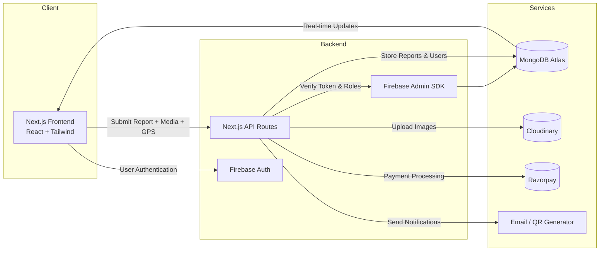

# Environmental Compliance Network (ECN)

A citizen-driven web platform for reporting, verifying, and tracking environmental issues in real time using modern web technologies.

---

## 📌 Project Description

Environmental Compliance Network (ECN) is a full-stack web application designed to address challenges in environmental monitoring such as delayed reporting, lack of transparency, and limited public participation. The platform enables citizens to report environmental violations with geotagged images/videos, while authorities and NGOs can verify, track, and resolve these issues through structured workflows.

---

## ❓ Problem Statement

Environmental violations like air pollution, water contamination, illegal dumping, and industrial leakage are often underreported or poorly tracked. Existing systems lack transparency, real-time tracking, and public accountability.

---

## 🎯 Objectives

- Enable citizens to report environmental issues easily
- Ensure authenticity through metadata and verification
- Provide authorities with structured complaint management
- Improve transparency using map-based visualization
- Encourage public participation in environmental protection

---

## 🚀 Features

- 📸 Image & video-based environmental reporting
- 📍 Automatic GPS geotagging
- 🆔 Unique Complaint ID for tracking
- 🗺️ Interactive map with filters
- 🔐 Role-based authentication (Citizen, Authority, NGO, Admin)
- 📊 Dedicated dashboards for each role
- 🔎 Verification using metadata & validation logic
- 💳 Subscription & payment support (Razorpay)
- 📱 Fully responsive design

---

## 🧑‍🤝‍🧑 System Roles

- **Citizen** – Submit and track reports
- **Authority** – Review, verify, and resolve complaints
- **NGO** – Access aggregated environmental data
- **Admin** – Manage users, reports, and system settings

---

## 🛠 Tech Stack

### Frontend
- Next.js (App Router)
- React.js
- Tailwind CSS
- Leaflet / React-Leaflet
- Lucide Icons

### Backend
- Next.js API Routes
- Node.js
- JWT Authentication

### Database & Storage
- MongoDB Atlas
- Mongoose
- Cloudinary (media storage)

### Payments
- Razorpay

---

## 📂 Project Structure
``` app/
├─ api/
│ ├─ auth/
│ ├─ reports/
│ ├─ users/
│ └─ payments/
├─ dashboard/
│ ├─ citizen/
│ ├─ authority/
│ ├─ ngo/
│ └─ admin/
├─ reports/
├─ map/
└─ (auth)/

components/
lib/
middleware/
```


## 🔐 Environment Variables

Create a `.env.local` file in the root directory:
```
MONGODB_URI=
JWT_SECRET=
NEXT_PUBLIC_CLOUDINARY_CLOUD_NAME=
CLOUDINARY_API_KEY=
CLOUDINARY_API_SECRET=
RAZORPAY_KEY_ID=
RAZORPAY_KEY_SECRET=
NEXT_PUBLIC_APP_URL=http://localhost:3000
```


---

## ⚙️ Installation & Setup

```bash
git clone https://github.com/your-username/environmental-compliance-network.git
cd environmental-compliance-network
npm install
```

## ▶️ Run the Project
```bash
npm run dev
```

## Open in browser:

http://localhost:3000


## 🔄 Workflow Overview

1. User submits a report with media (images/videos) and GPS location.
2. The system validates metadata and verifies the location.
3. Each report is assigned a unique **Complaint ID**.
4. Concerned authorities review the report and update its status.
5. The public map updates in real time to reflect report status.
6. Users receive notifications whenever the status changes.

---

## 📈 Expected Outcome

- Transparent and accountable environmental reporting system  
- Faster response from authorities to reported violations  
- Reliable, structured data for NGOs and researchers  
- Increased citizen participation in environmental protection  
- Scalable and secure digital platform  

---

## ⚠️ Limitations

- Requires an active internet connection  
- Partial manual verification is still required  
- GPS accuracy depends on the user’s device  
- High report volume may delay authority response  

---

## 🔮 Future Enhancements

- AI-based image classification for automated validation  
- Dedicated mobile application (Android & iOS)  
- Multilingual support for wider accessibility  
- Push notifications for real-time updates  
- Advanced analytics dashboard for insights and reporting  

---

# 👨‍💻 Author

**Omkar Nitin Parelkar**  

---

## 📜 License

This project is developed strictly for **academic purposes** as a final-year undergraduate project.


<!-- Project Banner -->
<p align="center">
  
</p>

---

<!-- Badges -->
<p align="center">
  
  
  
  
  
</p>

---

## 🌍 Platform Overview

<p align="center">
  
</p>

---

## 📊 System Architecture




